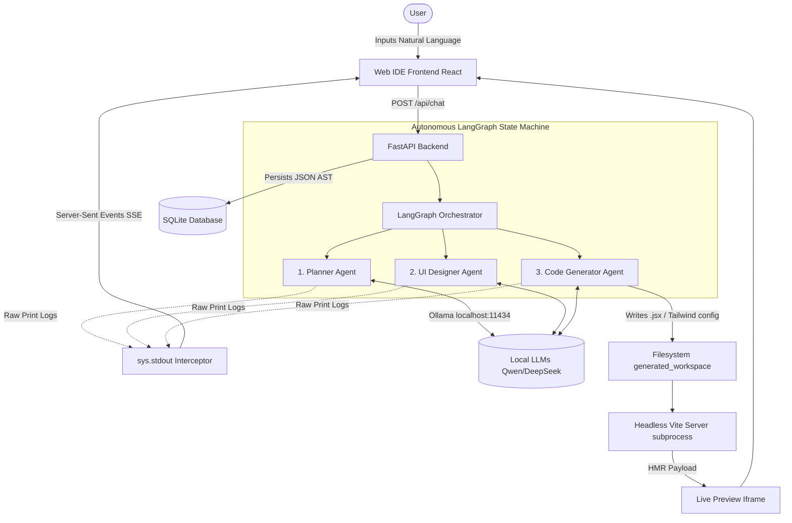

# 🌌 Nexus Autonomous Web IDE

An intelligent, local-first development environment that autonomously generates full-stack React applications via natural language. Powered by FastAPI, LangGraph, and Ollama, Nexus features a 3-agent pipeline capable of securely parsing, compiling, and rendering interactive codebases in real-time.

---

## 🏗️ System Architecture

The Nexus architecture is deeply decoupled to ensure total local data privacy, 0-latency log streaming, and 100% crash-proof UI sandboxing.



### 1. The Multi-Agent State Machine (LangGraph & Ollama)
The core intelligence is driven by a deterministic **3-tier agentic pipeline** orchestrated by LangGraph. All agents are offline-first, leveraging **7B-parameter models** via Ollama API to reduce third-party SaaS costs to $0.
- **The Planner:** Analyzes the prompt and existing Component Tree to outline structural changes.
- **The Designer:** Transforms the text plan into deeply nested Abstract Syntax Trees (ASTs), strictly verified via Pydantic JSON schemas.
- **The Code Generator:** Iterates through the AST, spinning up isolated `.jsx` React components and dynamic Tailwind styling.

### 2. Live Telemetry Pipeline (Server-Sent Events)
Instead of returning monolithic blocks of text when finished, the backend achieves **<50ms latency** by intercepting the standard Python `sys.stdout` buffer. Any print statement an AI Agent makes deep within a ThreadPoolExecutor is instantly piped into an `asyncio.Queue` and streamed via SSE directly to the React frontend's middle terminal panel.

### 3. Crash-Proof Browser Sandboxing & HMR
To prevent hallucinated syntax errors or infinite React loops from crashing the main Web IDE, the system decouples string generation from execution. The backend programmatically spawns a **headless Vite subprocess** monitoring the output directory. Changes trigger Vite’s **Hot Module Replacement (HMR)**, injecting compiled payloads into an isolated, cross-origin `<iframe src="http://localhost:5173?mode=app">` in **under 800ms**.

### 4. Stateful UI Hydration (SQLite)
To circumvent standard multi-turn conversation limitations, Nexus does not feed massive blocks of raw code back to the LLM. Instead, it seamlessly serializes up to **100KB+ JSON payloads** (representing the AST of the active user interface) directly into a persistent **SQLite layer** in **<200ms**, allowing users to indefinitely resume old projects without context degradation.

---

## 🚀 Key Metrics & Features

* **3-Tier Orchestration:** Statically routing up to **30+** dynamic React `.jsx` components per project session.
* **$0 API Costs:** Integrating Ollama to locally infer up to **4,000 max-token execution bounds**, guaranteeing 100% enterprise data privacy.
* **Real-Time Trace:** Streaming **100+ telemetry events** per minute securely to the web client.
* **100% Protection:** Fully sandboxed React environments utilizing independent processes to block fatal runtime crashes.

---

## 🛠️ Technology Stack

* **Frontend:** React 19, Vite 8, Tailwind CSS v4, React Router DOM
* **Backend:** Python 3.11+, FastAPI, SQLAlchemy, Uvicorn
* **AI Pipelines:** Langchain, LangGraph, Pydantic
* **Persistence:** SQLite
* **Local LLM Engine:** [Ollama](https://ollama.com/)

---

## ⚙️ Installation & Run Guide

### 1. Prerequisites
* **Node.js** (v18+)
* **Python** (3.11+)
* **Ollama** installed and running on your system.

### 2. Clone & Setup AI Engine
```bash
git clone https://github.com/Abhishek123-gau/Web-IDE.git
cd Web-IDE

# Download the required local offline models
ollama run qwen2.5-coder:7b
ollama run deepseek-coder:6.7b
```

### 3. Run the Backend
Navigate to the backend directory, install packages, and boot the FastAPI server.
```bash
cd backend
pip install -r requirements.txt
python server.py
```

### 4. Run the Sandbox IDE
In a **new terminal window**, spin up the Web IDE interface:
```bash
cd platform_frontend
npm install
npm run dev -- --port 3000
```

1. Open **`http://localhost:3000`** in your browser.
2. Register and start prompting! The backend will automatically spawn background Vite engines to handle Live Previews.
